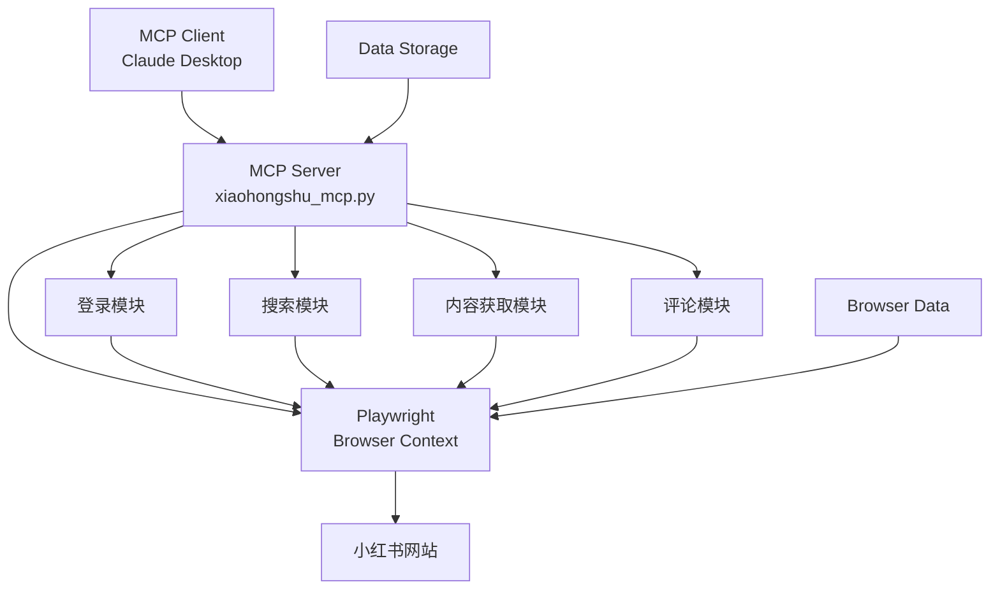

# 小红书自动搜索评论工具

## MCP Server 2.0

基于 Playwright 开发的小红书自动化工具，支持搜索、内容获取、智能评论等功能

<div class="mt-12 text-lg">
  <div class="grid grid-cols-2 gap-4">
    <div>
      <h3>🎯 核心特性</h3>
      <ul class="text-left">
        <li>AI 智能评论生成</li>
        <li>模块化设计</li>
        <li>持久化登录</li>
        <li>多维度内容获取</li>
      </ul>
    </div>
    <div>
      <h3>🔧 技术栈</h3>
      <ul class="text-left">
        <li>Python 3.8+</li>
        <li>Playwright</li>
        <li>FastMCP</li>
        <li>Docker 支持</li>
      </ul>
    </div>
  </div>
</div>

---
layout: center
transition: fade-out
---

# 项目概述

## 基于原项目全面优化

- **原项目**: [JonaFly/RednoteMCP](https://github.com/JonaFly/RednoteMCP.git)
- **优化内容**: 内容获取增强、AI 评论生成、模块化设计
- **版本**: 2.0 - 深度集成 AI 能力

## 主要改进

- ✅ 内容获取能力大幅提升 (4种获取方法)
- ✅ AI 驱动的智能评论生成
- ✅ 模块化架构 (分析/生成/发布分离)
- ✅ 更完善的错误处理和调试信息

---
layout: two-cols
transition: slide-up
---

# 核心功能

## 功能模块

::left::

### 🔐 用户认证
- 持久化登录状态
- 扫码登录支持
- 自动状态检测

### 🔍 内容发现
- 关键词智能搜索
- 多维度内容获取
- 完整笔记信息提取

### 💬 智能评论
- AI 生成自然评论
- 四种评论类型
- 两步式评论流程

::right::

### 📊 数据处理
- 结构化数据返回
- 评论数据获取
- 实时反馈机制

### 🛠️ 技术特性
- Playwright 自动化
- MCP Server 架构
- Docker 容器化部署

---
layout: center
class: text-center
transition: zoom-in
---

# 部署流程

## 从零开始部署项目

---

# 环境准备

## 1. Python 环境

```bash
# 检查 Python 版本 (需要 3.8+)
python --version
python3 --version

# 创建虚拟环境
python3 -m venv venv

# 激活虚拟环境
# Windows:
venv\Scripts\activate
# macOS/Linux:
source venv/bin/activate
```

## 2. 安装依赖

```bash
# 安装 Python 包
pip install -r requirements.txt
pip install fastmcp

# 安装 Playwright 浏览器
playwright install
```

---
layout: center
transition: fade
---

# Docker 部署

## 容器化部署方案

```dockerfile
FROM python:3.9-slim

WORKDIR /app

# 安装系统依赖和浏览器
RUN apt-get update && apt-get install -y \
    wget gnupg ca-certificates \
    fonts-liberation libasound2 libatk-bridge2.0-0 \
    libatk1.0-0 libatspi2.0-0 libcups2 libdbus-1-3 \
    libdrm2 libgbm1 libgtk-3-0 libnspr4 libnss3 \
    libwayland-client0 libxcomposite1 libxdamage1 \
    libxfixes3 libxkbcommon0 libxrandr2 xdg-utils

# 复制文件并安装依赖
COPY requirements.txt .
COPY xiaohongshu_mcp.py .
RUN pip install --no-cache-dir -r requirements.txt
RUN playwright install chromium

# 创建目录
RUN mkdir -p browser_data data

EXPOSE 8000
CMD ["python", "xiaohongshu_mcp.py"]
```

---
layout: center
transition: slide-left
---

# MCP 配置

## 连接到 MCP Client

### Claude Desktop 配置示例

```json
{
  "mcpServers": {
    "xiaohongshu MCP": {
      "command": "C:\\Users\\username\\Desktop\\MCP\\Redbook-Search-Comment-MCP2.0\\venv\\Scripts\\python.exe",
      "args": [
        "C:\\Users\\username\\Desktop\\MCP\\Redbook-Search-Comment-MCP2.0\\xiaohongshu_mcp.py",
        "--stdio"
      ]
    }
  }
}
```

### 重要提醒

- 使用**完整绝对路径**
- Windows 路径需要双重转义
- 确保虚拟环境路径正确

---
layout: center
class: text-center
transition: zoom-out
---

# 登录流程

## 首次使用登录

---

# 登录步骤

## 1. 启动服务器

```bash
# 激活虚拟环境后运行
python xiaohongshu_mcp.py
```

## 2. 在 MCP Client 中登录

**发送命令:**
```
帮我登录小红书账号
```

或

```
请登录小红书
```

## 3. 手动扫码登录

- 系统会打开浏览器窗口
- 显示小红书登录页面
- 使用手机扫码完成登录
- 登录状态自动保存

## 4. 登录成功确认

```
已登录小红书账号
```

---
layout: center
transition: fade-out
---

# 搜索流程

## 智能内容搜索

---

# 搜索操作

## 基本搜索语法

**工具函数:**
```
mcp0_search_notes(keywords="关键词", limit=5)
```

**在 MCP Client 中的使用:**

```
帮我搜索小红书笔记，关键词为：美食
```

```
帮我搜索小红书笔记，关键词为旅游，返回10条结果
```

## 搜索结果示例

```
搜索结果：

1. 标题: 北京胡同美食探店指南
   链接: https://www.xiaohongshu.com/search_result/xxxxx

2. 标题: 京城小吃推荐
   链接: https://www.xiaohongshu.com/search_result/yyyyy

3. 标题: 老北京风味
   链接: https://www.xiaohongshu.com/search_result/zzzzz
```

---
layout: center
transition: slide-up
---

# 内容获取

## 获取笔记详情

---

# 内容获取流程

## 获取笔记内容

**工具函数:**
```
mcp0_get_note_content(url="笔记URL")
```

**使用示例:**
```
帮我获取这个笔记的内容：
https://www.xiaohongshu.com/search_result/xxxxx
```

## 返回信息

- 📝 **标题**: 笔记标题
- 👤 **作者**: 笔记作者
- 🕒 **发布时间**: 发布时间
- 🔗 **链接**: 原始链接
- 📄 **内容**: 完整正文内容

## 技术实现

- 4种不同的内容获取方法
- 页面滚动加载完整内容
- 智能区分正文和评论内容

---
layout: center
class: text-center
transition: zoom-in
---

# 评论流程

## AI 智能评论生成

---

# 评论类型

## 四种评论类型

| 类型 | 描述 | 适用场景 |
|------|------|----------|
| **引流型** | 引导关注或私聊 | 增加粉丝互动 |
| **点赞型** | 简单互动 | 提升曝光率 |
| **咨询型** | 问题形式 | 增加博主回复 |
| **专业型** | 专业知识 | 建立权威形象 |

## 评论生成流程

### 1. 笔记分析
```
mcp0_post_smart_comment(url="笔记URL", comment_type="类型")
```

### 2. AI 生成评论
- MCP Client (Claude) 接收笔记分析结果
- 基于内容和类型生成自然评论

### 3. 评论发布
```
mcp0_post_comment(url="笔记URL", comment="评论内容")
```

---
layout: two-cols
transition: slide-left
---

# 工作原理

## 两步式评论流程

::left::

### 📊 步骤1: 笔记分析
- 调用 `post_smart_comment`
- 获取笔记标题、作者、内容
- 分析领域和关键词
- 返回结构化 JSON 数据

### 🤖 步骤2: AI 生成
- MCP Client 接收分析结果
- Claude 根据内容生成评论
- 支持四种评论类型
- 确保评论自然相关

::right::

### 📤 步骤3: 评论发布
- 调用 `post_comment` 工具
- 定位评论输入框
- 发布生成的评论
- 返回发布结果

### 🔄 完整流程示例

```
用户: 帮我为这个笔记写专业评论
Claude: 获取笔记信息 → 生成评论 → 发布评论
```

---
layout: center
transition: fade
---

# 技术架构

## 系统设计

---

# 架构图



## 核心组件

- **FastMCP**: MCP 服务器框架
- **Playwright**: 浏览器自动化
- **Asyncio**: 异步处理
- **持久化上下文**: 保存登录状态

---
layout: center
transition: slide-up
---

# 使用示例

## 完整工作流程演示

---

# 实际使用场景

## 北京旅游攻略搜索

### 1. 登录
```
帮我登录小红书账号
```
→ 扫码登录成功

### 2. 搜索攻略
```
帮我搜索小红书笔记，关键词为：北京旅游攻略
```
→ 返回相关笔记列表

### 3. 查看内容
```
帮我获取这个笔记的内容：
https://www.xiaohongshu.com/explore/xxxxx
```
→ 显示完整攻略内容

### 4. 生成评论
```
帮我为这个笔记写一条专业类型的评论：
https://www.xiaohongshu.com/explore/xxxxx
```
→ AI 生成并发布专业评论

---
layout: center
class: text-center
transition: zoom-out
---

# 注意事项

## 使用指南和限制

---

# 重要提醒

## ⚠️ 使用注意事项

- **平台规则**: 严格遵守小红书平台规定
- **评论频率**: 每天评论数量不超过30条
- **账号安全**: 避免过度操作，防止账号风险
- **内容质量**: 确保评论内容真实有价值

## 🔧 常见问题

### 连接问题
- 检查 Python 路径是否正确
- 确保虚拟环境已激活
- 验证 MCP 配置格式

### 浏览器问题
- 删除锁文件: `rm browser_data/SingletonLock`
- 重启服务器
- 检查浏览器数据目录

### 内容获取问题
- 增加页面加载等待时间
- 尝试不同的获取方法
- 检查链接有效性

---
layout: center
transition: fade-out
---

# 总结

## 项目特色与优势

---

# 项目亮点

## 🎯 核心优势

- **智能化**: AI 驱动的评论生成
- **自动化**: 全流程自动化操作
- **稳定性**: 持久化登录和错误处理
- **扩展性**: 模块化设计便于维护
- **易用性**: 简单的 MCP 集成

## 🚀 应用场景

- 内容营销和推广
- 数据收集和分析
- 社交媒体管理
- 自动化运营工具

## 📈 未来规划

- 支持更多社交平台
- 增强 AI 评论质量
- 添加数据分析功能
- 优化用户界面

---

# 感谢使用！

## 联系与反馈

- **项目地址**: GitHub Repository
- **原项目**: [JonaFly/RednoteMCP](https://github.com/JonaFly/RednoteMCP.git)
- **维护者**: windsurf

<div class="mt-12 text-center">
  <div class="text-2xl">🎉 祝您使用愉快！</div>
</div>

---
layout: end
---
